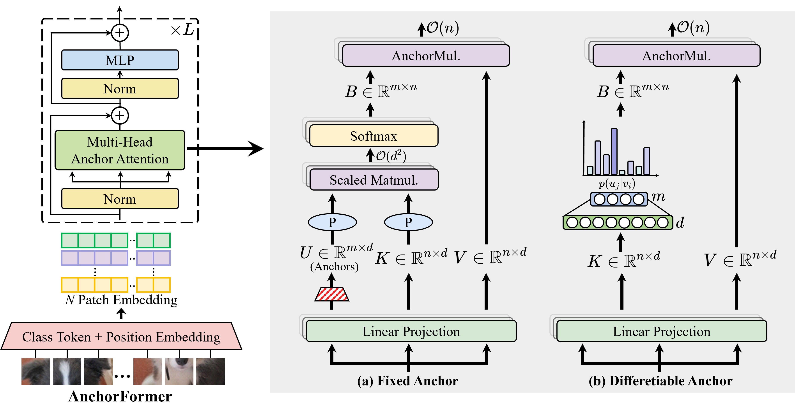

# AnchorFormer: Differentiable Anchor Attention for Efficient Vision Transformer 

## Introduction
This is a [Pytorch](https://pytorch.org) implementation of **AnchorFormer**:
>   Jiquan Shan, Junxiao Wang, Lifeng Zhao, Liang Cai, Hongyuan Zhang, and Ioannis Liritzis<sup>\*</sup>, "AnchorFormer: Differentiable Anchor Attention for Efficient Vision Transformer", *Pattern Recognition Letters*, 2025. ([arXiv](https://arxiv.org/abs/2505.16463))




## Contact
If you have any question about this project, please contact hyzhang98@gmail.com.

## Citation

If you find the code useful for your research, please consider citing our work:

```
@article{AnchorFormer,
  author={Jiquan Shan and Junxiao Wang and Lifeng Zhao and Liang Cai and Hongyuan Zhang and Ioannis Liritzis},
  journal={Pattern Recognition Letters},
  title={AnchorFormer: Differentiable Anchor Attention for Efficient Vision Transformer}, 
  year={2025},
  pages={},
}
```
